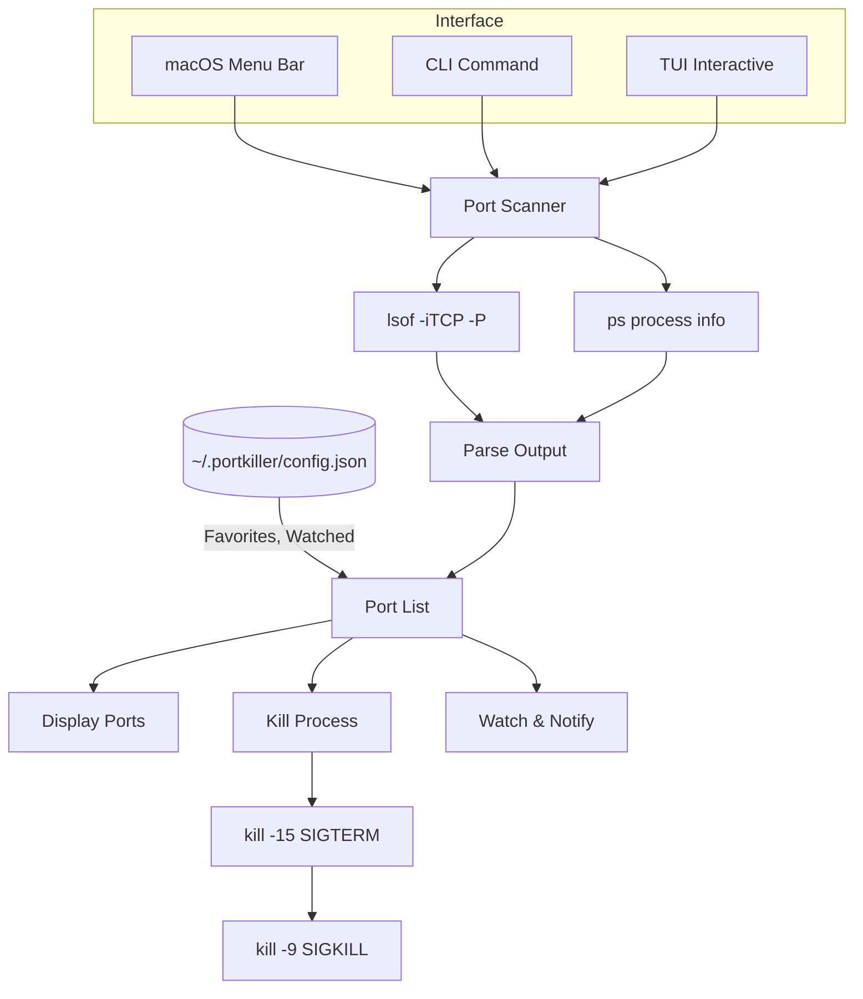

# PortKiller

<p align="center">
  
</p>

<p align="center">
  <a href="LICENSE"></a>
  <a href="https://www.apple.com/macos/"></a>
  <a href="https://swift.org"></a>
  <a href="https://github.com/productdevbook/port-killer/releases"></a>
</p>

<p align="center">
A native macOS menu bar app for finding and killing processes on open ports.<br>
Perfect for developers who need to quickly free up ports like 3000, 8080, 5173, etc.
</p>

<p align="center">
  
</p>

## Installation

### macOS App (Homebrew)

```bash
brew install --cask productdevbook/tap/portkiller
```

### CLI Tool (Homebrew)

```bash
brew install productdevbook/tap/portkiller
```

### Download

Download from [GitHub Releases](https://github.com/productdevbook/port-killer/releases).

## CLI Usage

```bash
# List all listening ports
portkiller

# Interactive TUI mode
portkiller tui
# or
portkiller -i

# Kill process on specific port
portkiller kill 3000

# Force kill
portkiller kill 3000 -f
```

### TUI Keybindings

| Key | Action |
|-----|--------|
| `j/k` | Navigate up/down |
| `x` | Kill process |
| `X` | Force kill |
| `space` | Select multiple |
| `f` | Toggle favorite |
| `w` | Toggle watch |
| `/` | Command palette |
| `?` | Help |
| `q` | Quit |

## How It Works



## Features

- 📍 Menu bar integration
- 🔍 Auto-discovers listening TCP ports
- ⚡ One-click process termination
- 🔄 Auto-refresh every 5 seconds
- 🔎 Search by port or process name

## Platform Support

| Platform | Status |
|----------|--------|
| macOS | Supported |
| Linux | In Progress |
| Windows | In Progress |

## Contributing

See [CONTRIBUTING.md](CONTRIBUTING.md) for development setup.

## Sponsors

<p align="center">
  <a href="https://cdn.jsdelivr.net/gh/productdevbook/static/sponsors.svg">
    
  </a>
</p>

## License

MIT License - see [LICENSE](LICENSE).
